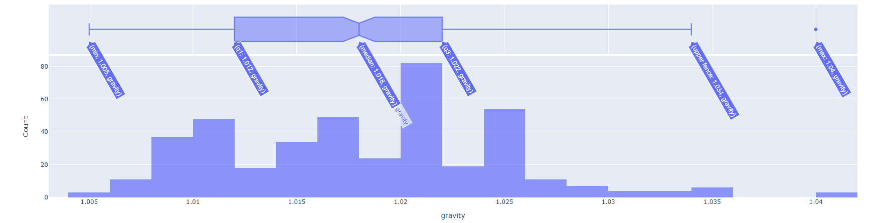
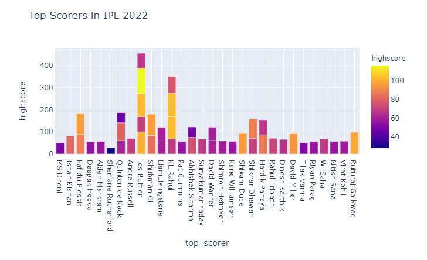
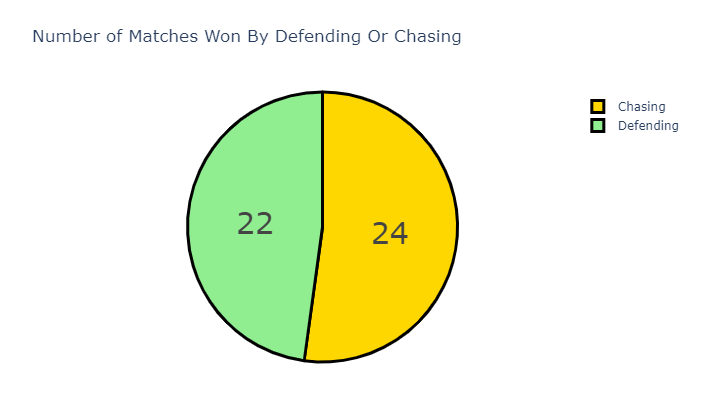

# 🏏 IPL 2022 Data Analysis using R

## 🔍 Overview

The **Indian Premier League (IPL)** is one of the world’s most-watched Twenty20 cricket leagues, attracting millions of fans every year. This project dives into the **IPL 2022 season** using the **R programming language** to uncover patterns, performance trends, and insights.

We explored:
- Matches won by each team
- Toss decisions and outcomes (bat/field)
- Wins by defending or chasing
- Top scorers & best bowlers
- Player of the Match awards
- Wickets taken at various venues

---

## 📊 Dataset

- File: `IPL 2022.csv`  
- Rows: 60  
- Columns: 18  
- Key Fields:  
  - Match number, date, venue  
  - Toss winner & decision  
  - Match result, winning team  
  - Top performer stats

> 📺 *Over 30.7 crore viewers tuned in to the live broadcast of the first 10 matches — making IPL 2022 the 2nd highest viewed season start in IPL history.*

---

## 🧰 Tools & Technologies

- **Language:** R
- **Libraries:**  
  - `tidyverse` – Data cleaning and manipulation  
  - `ggplot2` – Static data visualization  
  - `plotly` – Interactive graphs and dashboards

---

## 📈 Analysis Approach

- **Data Cleaning**: Removed duplicates, handled missing values, dropped irrelevant columns  
- **Transformation**: Converted categorical variables like `toss_decision` and `won_by` to numeric form for better analysis  
- **Feature Engineering**:  
  - Created `first_ings_wkts` and `second_ings_wkts` to analyze bowling performances  
  - Mapped player and team contributions across venues

---

## 🖼️ Screenshots

### 📌 Analysis Graphs 

---

## 👨‍💻 Author

**Tanmay Arya**  
🎓 Duke University – MQM '26  
📊 Passionate about Data Analytics, ML, and Sports Intelligence
